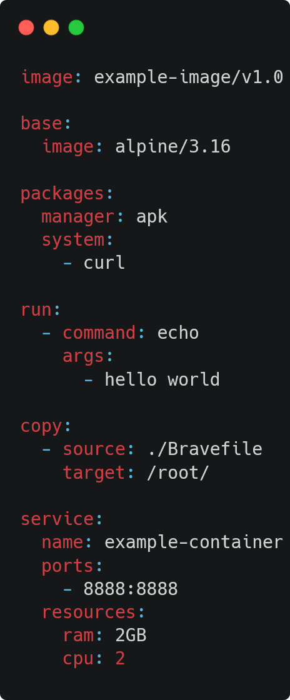
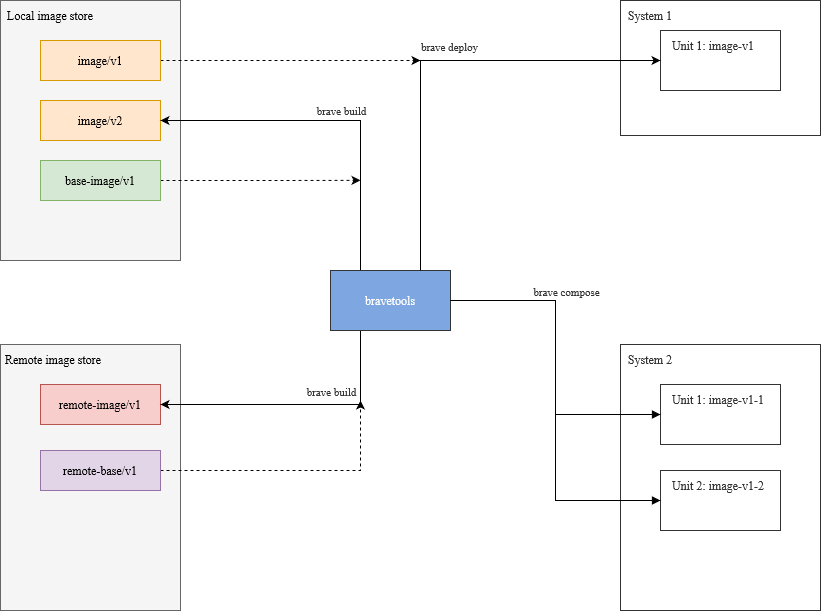
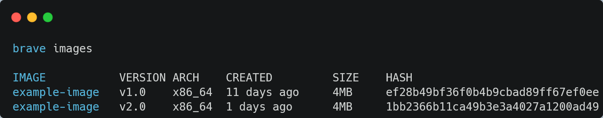
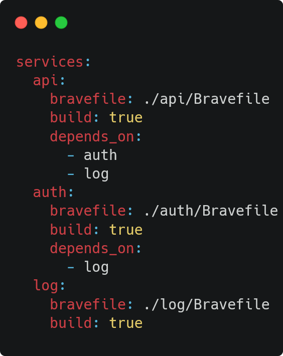

[](https://gitter.im/bravetools/community?utm_source=badge&utm_medium=badge&utm_campaign=pr-badge) [](https://goreportcard.com/report/github.com/bravetools/bravetools)


  # Bravetools
Bravetools provides a simple and consistent interface to declare, build, and deploy [system containers](https://documentation.ubuntu.com/lxd/en/latest/explanation/containers_and_vms/#application-containers-vs-system-containers).

# Features

* [Build, version control, and share reproducible application and environment images](https://bravetools.github.io/bravetools/docs/bravefile/).
* [Compose multi-container systems](https://bravetools.github.io/bravetools/docs/compose/) in a simple and declarative way.
* [Deploy your systems](https://bravetools.github.io/bravetools/docs/cli/brave_deploy/) locally or remotely.

# How it works
## Configuring image environments
The steps to build and deploy an image are configured using a [Bravefile](https://bravetools.github.io/bravetools/docs/bravefile/).  
View [sample Bravefiles](https://github.com/beringresearch/bravefiles/) on GitHub to explore common use cases.



## Build images
Build new images or layer existing ones using `brave build`  
Resulting image can be stored locally or remotely


## Deploy images
System containers can be deployed to a variety of environments with `brave deploy`, including local development machines, test environments, and remote production systems.



## Image management
Manage images with multiple versions and architectures



## Deploy multi-unit systems
Systems with multiple units can be declared in a [brave compose file](https://bravetools.github.io/bravetools/docs/compose/#compose-file).  
Build and deploy the system defined in a compose file with the `brave compose` command.



# Installation

Prerequisites:

* Mac/Windows: [Multipass](https://multipass.run)
* Linux:
  - [LXD](https://documentation.ubuntu.com/lxd/en/latest/)
  - Ensure your user belongs to the `lxd` group: `sudo usermod --append --groups lxd $USER`
  - You may also need `zfsutils`: `sudo apt install zfsutils-linux`

1. Download the [latest stable release](https://github.com/bravetools/bravetools/releases) for your host platform and add it to your `$PATH`.

2. Run `brave init` to get started.

## Installing from source

### Linux/MacOS
```bash
git clone https://github.com/bravetools/bravetools
cd bravetools
make [ubuntu]/[darwin]
```

### Windows
```bash
git clone https://github.com/bravetools/bravetools
cd bravetools
go build -ldflags="-s -w" -o brave.exe -trimpath main.go
```

# Getting Started
Run `brave init` to start if you haven't yet.
```bash
brave init
...
```

Create an example Bravefile
```bash
brave template
```
This creates a file named "Bravefile" in the current working directory. The contents should look like this:
```yaml
image: example-image/v1.0

base:
  image: alpine/3.16

packages:
  manager: apk
  system:
    - curl

run: 
  - command: echo
    args:
      - hello world

copy:
  - source: ./Bravefile
    target: /root/

service:
  name: example-container
  ports:
    - 8888:8888
  resources:
    ram: 2GB
    cpu: 2

```

Create an image using the Bravefile
```bash
brave build
...
```

Check images
```bash
brave images

IMAGE           VERSION ARCH    CREATED         SIZE    HASH
example-image   v1.0    x86_64  just now        4MB     ef28b49bf36f0b4b9cbad89ff67ef0ee
```

Deploy image as container
```bash
brave deploy
```

Check running units
```bash
brave units

NAME                    STATUS  IPV4            MOUNTS  PORTS     
example-container       Running 10.148.59.45            8888:8888
```

Add a remote
```bash
brave remote add example-remote https://20.0.0.20:8443 --password [PASSWORD]

Certificate fingerprint:  ...
```

Deploy to remote
```bash
brave deploy --name example-remote:example-container
```

```bash
brave units

NAME                                    STATUS  IPV4            MOUNTS  PORTS
example-remote:example-container        Running 20.0.0.7                8888:8888

example-container                       Running 10.148.59.45            8888:8888
```

# Command Reference

```
A complete System Container management platform

Usage:
  brave [command]

Available Commands:
  base        Pull a base image from LXD Image Server or public Github Bravefile
  build       Build an image from a Bravefile
  compose     Compose a system from a set of images
  configure   Configure local host parameters
  deploy      Deploy Unit from image
  help        Help about any command
  images      List images
  import      Import LXD image tarballs into local Bravetools image repository
  info        Display workspace information
  init        Create a new Bravetools host
  mount       Mount a directory to a Unit
  publish     Publish deployed Units as images
  remote      Manage remotes
  remove      Remove Units or Images
  start       Start Units
  stop        Stop Units
  template    Generate a template Bravefile
  umount      Unmount <disk> from UNIT
  units       List Units
  version     Show current bravetools version

Flags:
  -h, --help   help for brave

Use "brave [command] --help" for more information about a command.
```