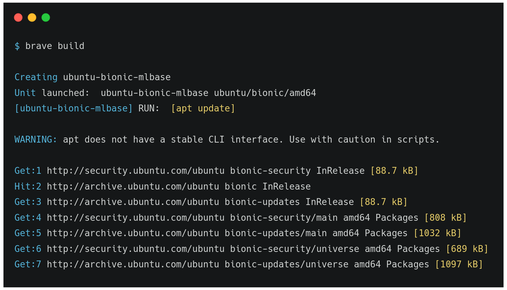

# Bravetools
{: .fs-9 }

Bravetools is an open source tool for creating and managing System Containers for multiple platforms using a single source configuration. Bravetools makes it easy to build, deploy, and scale machine images.
{: .fs-6 .fw-300 }

[Get started now](installation){: .btn .btn-primary .fs-5 .mb-4 .mb-md-0 .mr-2 } [View it on GitHub](https://github.com/beringresearch/bravetools){: .btn .fs-5 .mb-4 .mb-md-0 }

---

## Infrastructure as code

{:class="img-responsive"}

Bravetools automates the creation of your application technology stack. It encourages simplicity, flexible configuration, and efficient dependency management.